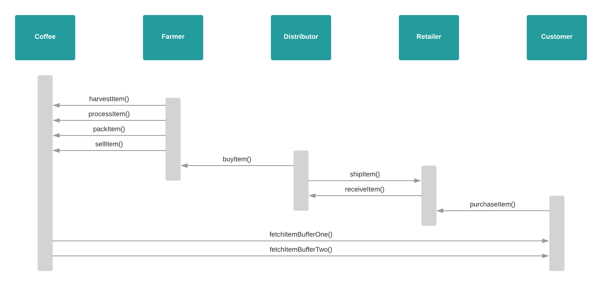

# Supply chain & data auditing

This repository contains an Ethereum DApp that demonstrates a Supply Chain flow between a Seller and Buyer. The user story is similar to any commonly used supply chain process. A Seller can add items to the inventory system stored in the blockchain. A Buyer can purchase such items from the inventory system. Additionally a Seller can mark an item as Shipped, and similarly a Buyer can mark an item as Received.

## UML Diagrams

**Acitvity diagram**

**Sequence diagram**

**State diagram**

**Class diagram**

## Contract details (Rinkeby network)

**Txn Hash:** 0x6810136dfc0cf5f43395f1ad2072b1b48ae7850e2a6357938fcaaf1f4b8910a3

**Address:** 0xa6331F9440996e62A4aa893a4803D3815fcfbad8

**Etherscan Link:** https://rinkeby.etherscan.io/address/0xa6331f9440996e62a4aa893a4803d3815fcfbad8

## Libraries used

- Truffle v5.5.11
- Node v16.15.0 
- Web3.js v1.5.3
- truffle-hdwallet-provider (HD Wallet-enabled Web3 provider)
- truffle-contract (Better Ethereum contract abstraction, for Node and the browser)

## IPFS

Has not been used for this project.

## Run locally

- ``npm install``
- ``truffle compile``
- ``truffle migrate``
- ``truffle test``
- ``npm run dev``
- Run Ganache as CLI or GUI with Mnemonic:
  - ``spirit supply whale amount human item harsh scare congress discover talent hamster``
- Note: Use contract creator address as account in MetaMask

## Built with

* [Ethereum](https://www.ethereum.org/) - Ethereum is a decentralized platform that runs smart contracts
* [Truffle Framework](http://truffleframework.com/) - Truffle is the most popular development framework for Ethereum with a mission to make your life a whole lot easier.

